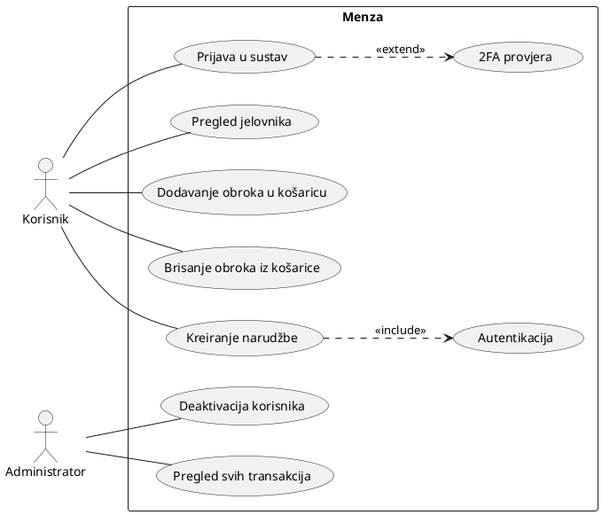
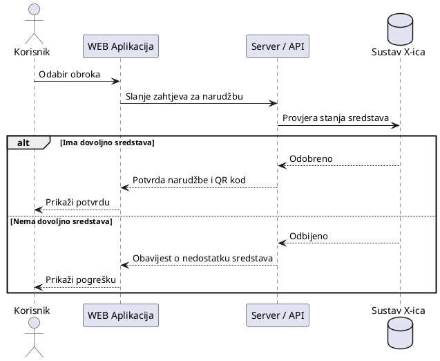
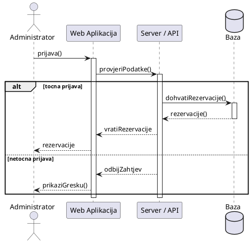
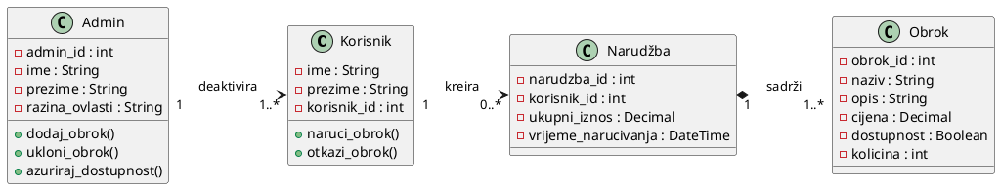

# UML Dijagrami 

## Akteri
- **Korisnik** — prijavljuje se u sustav, pregledava jelovnik, dodaje/briše obroke i kreira narudžbe
- **Administrator** — pregledava sve transakcije i deaktivira korisnike

## Ključni entiteti (klase)
- **Korisnik** — korisnik sustava koji naručuje obroke
- **Admin** — administrator sustava s povišenim ovlastima
- **Obrok** — stavka u jelovniku koja se može naručiti
- **Narudžba** — narudžba koju korisnik kreira, sadrži jedan ili više obroka

## 1. Use Case Dijagram

Korisnik se može prijaviti u sustav, pregledati jelovnik, dodati/obrisati obrok iz narudžbe i kreirati narudžbu. Kreiranje narudžbe uključuje autentikaciju. Dvofaktorska provjera opcionalno proširuje prijavu. Administrator može pregledati sve transakcije i deaktivirati korisnika.

## 2. Sequence Dijagram

### Scenarij 1: Naručivanje obroka

Korisnik šalje zahtjev UI-ju. UI prosljeđuje zahtjev API/serveru. API dohvaća podatke iz baze sustava X-ica. Ako korisnik ima dovoljno sredstava, UI vraća uspješan odgovor s potvrdom i QR kodom; inače prikazuje poruku o pogrešci.

Koraci:
1. Odabir obroka
2. Slanje zahtjeva
3. Provjera stanja sredstava
4. 4.1. Odobreno / 4.2. Odbijeno
5. 5.1. Potvrda narudžbe i QR kod / 5.2. Obavijest o nedostatku sredstava
6. 6.1. Prikaži potvrdu / 6.2. Prikaži pogrešku

### Scenarij 2: Pregledavanje rezervacija

Administrator se prijavljuje u sustav. UI prosljeđuje podatke API-ju. Ako je prijava točna, API dohvaća rezervacije iz baze i vraća ih UI-ju koji ih prikazuje administratoru; inače prikazuje pogrešku.

Koraci:
1. Prijava
2. Provjera podataka
3. Provjera je li prijava ispravna
4. 4.1. Ako je prijava točna — dohvaća rezervacije i vraća ih / 4.2. Ako je netočna — odbij zahtjev
5. Prikaži rezervacije

---

## 3. Class Dijagram

Sustav se sastoji od četiri klase: Korisnik, Admin, Obrok i Narudžba. Korisnik može kreirati jednu ili više narudžbi. Narudžba sadrži barem jedan obrok. Admin može deaktivirati barem jednog korisnika.

