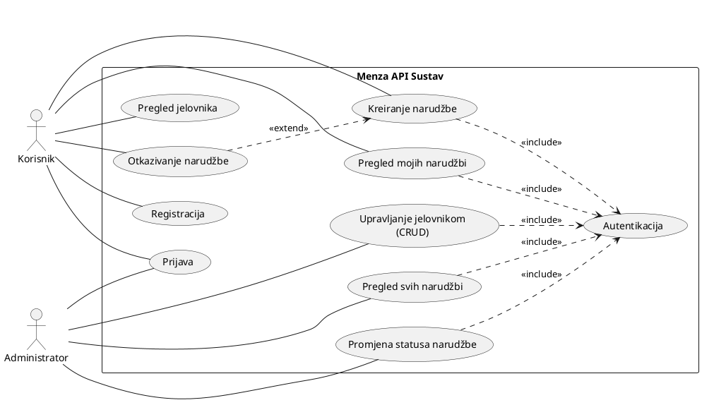
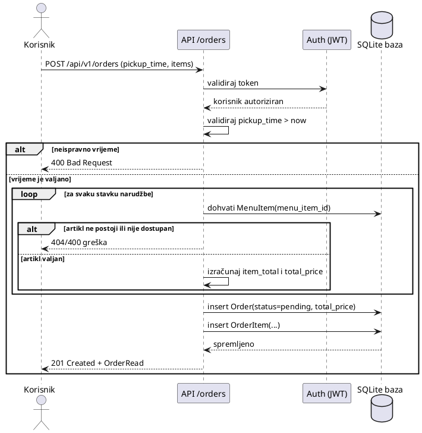
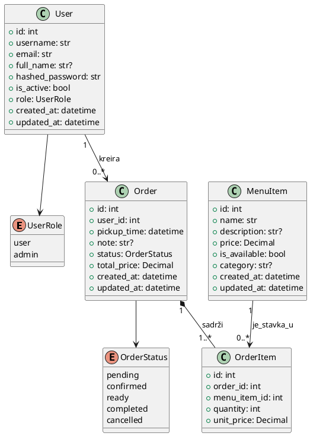

# UML modeli sustava (Menza API)

Ovaj dokument sadrži tri tražena UML dijagrama za projekt `Menza API`:
- Use Case dijagram
- Sequence dijagram (scenarij: korisnik kreira narudžbu)
- Class dijagram

## 1) Use Case dijagram

**Kratko objašnjenje**

Sustav koriste dva glavna aktera: `Korisnik` i `Administrator`.
Korisnik se registrira/prijavljuje, pregledava jelovnik i kreira vlastite narudžbe.
Administrator, uz prijavu, upravlja jelovnikom i statusima narudžbi.
Za zaštićene funkcionalnosti autentikacija je obavezna (`<<include>>`), dok je otkazivanje narudžbe opcionalno proširenje toka rada narudžbe (`<<extend>>`).

**PlantUML kod**

## 2) Sequence dijagram

**Kratko objašnjenje**

Scenarij prikazuje tok kreiranja narudžbe:
1) korisnik šalje zahtjev API-ju,
2) API validira vrijeme preuzimanja i stavke,
3) API provjerava svaki artikl u bazi,
4) ako je sve valjano, kreira narudžbu i stavke, te vraća uspješan odgovor.
U slučaju greške koristi se `alt` grana (npr. nepostojeći/nedostupan artikl ili vrijeme u prošlosti).

**PlantUML kod**

## 3) Class dijagram

**Kratko objašnjenje**

Domena se sastoji od korisnika, artikala jelovnika, narudžbi i stavki narudžbe.
Jedan korisnik može imati više narudžbi, a jedna narudžba sadrži jednu ili više stavki.
Svaka stavka se odnosi na jedan artikl jelovnika i pamti količinu i cijenu po jedinici u trenutku narudžbe.
Ulogu korisnika (`user/admin`) modelira enum `UserRole`, a stanje narudžbe enum `OrderStatus`.

**PlantUML kod**

